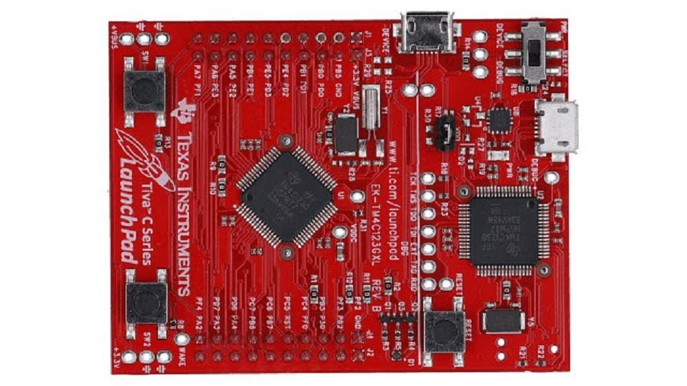

# Tiva™ TM4C123GH6PM Microcontroller

__________________________________________________________________________________
Examples on TIVAC board:-

1)  GPIO(Examples):

     Ex1) Turn on red led by pressing on switch 2

     Ex2) Toggle Blue led each new press on switch 1

     Ex3) Turn each led in the RGB leds for one second using delay function

     Ex4) Switch 1 flash red and blue leds each for half a second each new press, and the same
     for switch 2 but with blue and green leds.
_________________________________________________________________________________________________________________
2)  Systick-Timer(Examples):(Interrupts are not used in those two examples)

     Ex1) While pressing on switch 2 toggle the red led every 1 second using systick timer

     Ex2) Flash each led in the RGB leds for one second each using systick timer
_________________________________________________________________________________________________________________
3)  PLL(Examples):

     Ex1) While pressing on switch 2 toggle the red led every 1 second using systick timer and using clock 80MHZ

     Ex2) While pressing on switch 2 toggle the red led every 1 second using systick timer and using clock 10MHZ
_________________________________________________________________________________________________________________
4) NVIC(Examples):

     Ex1) 

          a) Use Blue Led at PF2.

          b) Generate Edge triggered interrupt on PF4 pin using SW1. Interrupt should be configured with the falling edge.
 
          c) Turn on the LED with the falling edge.

     Ex2) 

          a) MCU frequency 16MHZ

          b) Use the 3 RGB Led at PF1, PF2, and PF3

          c) A roll action is performed using the LEDs each led for 1 second. the first LED is lit and roll down to the last LED then back to the first LED. This operation is done continuously

          d) Generate Edge Triggered Interrupt on PF0 pin using SW2. Interrupt should be triggered with falling

          e) edge and it should turn on 3 RGB LEDs for 5 seconds when an interrupt occurs. Use delay function in the example

     Ex3) 
     
          a) MCU Frequency 16MHZ

          b) Use red led PF1

          c) Flash the led every half second

          d) Use systick timer to count to half second using interrupt technique

     Ex4)

          a) MCU Frequency is 80MHZ (Use PLL)

          b) Use 3 RGB LEDS at PF1, PF2, and PF3

          c) A roll action is performed using the 3 LEDs each LED for 1 Second. This operation is done continuously
          
          d) Use SYSTICK timer to count the one second using interrupt technique

_________________________________________________________________________________________________________________