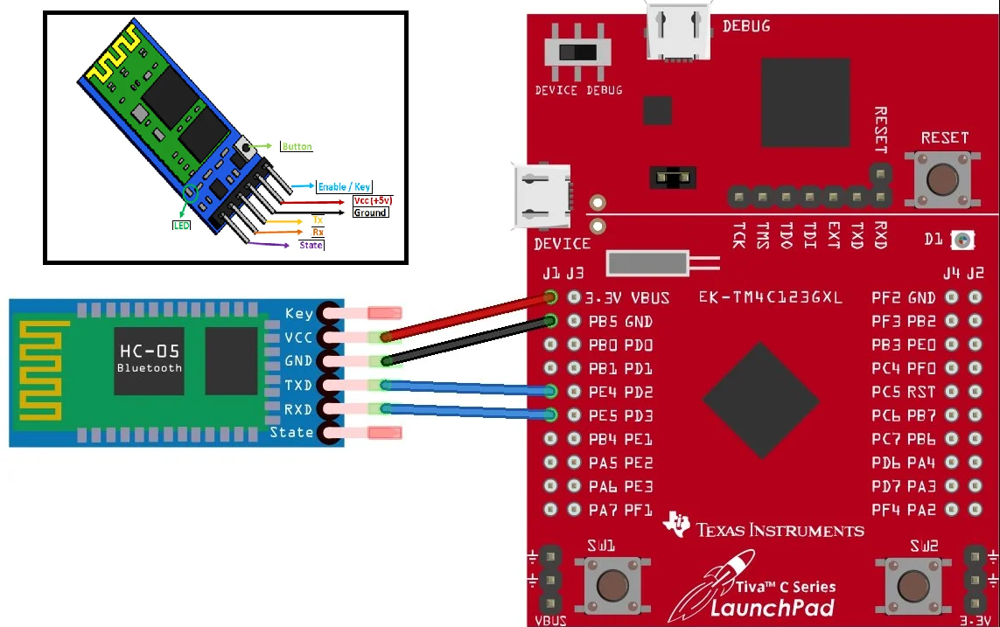

# Tiva™ TM4C123GH6PM Microcontroller

__________________________________________________________________________________
Examples on TIVAC board:-
__________________________________________________________________________________

1)  GPIO(Examples):
_____________________

     Ex1) Turn on red led by pressing on switch 2

     Ex2) Toggle Blue led each new press on switch 1

     Ex3) Turn each led in the RGB leds for one second using delay function

     Ex4) Switch 1 flash red and blue leds each for half a second each new press, and the same
     for switch 2 but with blue and green leds.

_________________________________________________________________________________________________________________
2)  Systick-Timer(Examples): ((Interrupts are not used in those two examples))
_____________________________________________________________________________

     Ex1) While pressing on switch 2 toggle the red led every 1 second using systick timer

     Ex2) Flash each led in the RGB leds for one second each using systick timer

_________________________________________________________________________________________________________________
3)  PLL(Examples):

     Ex1) While pressing on switch 2 toggle the red led every 1 second using systick timer and using clock 80MHZ

     Ex2) While pressing on switch 2 toggle the red led every 1 second using systick timer and using clock 10MHZ
     
_________________________________________________________________________________________________________________
4) NVIC(Examples):
_____________________

     Ex1) 

          a) Use Blue Led at PF2.

          b) Generate Edge triggered interrupt on PF4 pin using SW1. Interrupt should be configured with the falling edge.
 
          c) Turn on the LED with the falling edge.

     Ex2) 

          a) MCU frequency 16MHZ

          b) Use the 3 RGB Led at PF1, PF2, and PF3

          c) A roll action is performed using the LEDs each led for 1 second. the first LED is lit and roll down to the last LED then back to the first LED. This operation is done continuously

          d) Generate Edge Triggered Interrupt on PF0 pin using SW2. Interrupt should be triggered with falling

          e) edge and it should turn on 3 RGB LEDs for 5 seconds when an interrupt occurs. Use delay function in the example

     Ex3) 
     
          a) MCU Frequency 16MHZ

          b) Use red led PF1

          c) Flash the led every half second

          d) Use systick timer to count to half second using interrupt technique

     Ex4)

          a) MCU Frequency is 80MHZ (Use PLL)

          b) Use 3 RGB LEDS at PF1, PF2, and PF3

          c) A roll action is performed using the 3 LEDs each LED for 1 Second. This operation is done continuously
          
          d) Use SYSTICK timer to count the one second using interrupt technique

     Ex5)

          a) Same as exercise 4 in NVIC examples but MCU frequency is 16MHZ (NO PLL)

          b) Switch the access level to unprivileged by setting the bit 0 in the processor control register

          c) Call SysTick_Init after that it should trigger hard fault as SysTick  and NVIC registers could not be
          accessed in the unprivileged access level.  

     Ex6)

          a) Same as exercise 4 in NVIC examples but MCU frequency is 16MHZ (NO PLL)

          b) Switch the access level to unprivileged by setting the bit 0 in the processor control register

          c) Trigger the SVC exception using SVC instruction and in the SVC handler go back to privileged access level by clear bit 0 in the
          processor control register.

     Ex7)

          a) Same as exercise 4 in NVIC examples but MCU frequency is 16MHZ (NO PLL)

          b) Roll the three leds using a delay function in the main app

          c) Use the SysTick timer to count to 1 second using interrupt. after 5 seconds SysTick timer
          it will trigger and interrupt

          d) Inside the SysTick Handler turn all 3 LEDs for 5 seconds and turn on the pendSV inside it

          e) The PendSV should wait for the SysTick handler to finish first then start its exception

          f) Inside the PendSV handler turn off all the leds for 5 seconds then return back to main program   

     Ex8)

          a) We will run exercise 1 in GPIO but without activating the clock for PORTF
 
          b) This will lead to a HARD FAULT since the BUS FAULT is disabled

     Ex9)

          a) Same as example 8 but we will enable the BUS FAULT this time
 
          b) Same fault but will lead to BUS FAULT not a HARD FAULT
_________________________________________________________________________________________________________________
4) MPU(Examples):
_____________________

     Ex1) 

         a) This is example4 in NVIC examples but with clock frequency 16MHZ.

         b) We will enable memory management fault exception.

         c) Enable MPU at the beginning of the program for only two regions:
             -Region 1: FLASH EEPROM memory to be able to access code area

             -Region 2: SRAM memory to be able to access code area

         d) In this example a memory management fault will be triggered as a    result of accessing the register REGCGC2, since
             it is part from the system control space region.

     Ex2)

         a) Same as example one in the MPU but we will fix the fault by enabling the PRIVDEFENA bit in CTRL register to allow
             the privilege software to access the background area.

         b) We will enable memory management fault exception.

         c) Enable MPU at the beginning of the program for only two regions:
             -Region 1: FLASH EEPROM memory to be able to access code area

             -Region 2: SRAM memory to be able to access code area

         d) In this example the memory management fault will not be triggered.

     Ex3)

         a) Another fix for example one in MPU by giving access to system control region so we have to program the MPU for that region.

         b) We will enable memory management fault exception.

         c) Enable MPU at the beginning of the program for only two regions:
             -Region 1: FLASH EEPROM memory to be able to access code area

             -Region 2: SRAM memory to be able to access code area

             -Region 3: System Control Space to be able to access the registers to allow clock for PORTF

         d) In this example the memory management fault will not be triggered.

_________________________________________________________________________________________________________________
4) UART(Examples):
_____________________   

     Ex1)

          a) Use 16MHZ CPU frequency.

          b) Enable UART0.

          c)
           -Receive data from PC and re send it back again.

           -Receive string from PC till '#' and re send the string again.

           -Receive byte from PC and re send it back again. 

     Ex2)

          a) Use 16MHZ CPU frequency.

          b) Enable UART0.

          c)Receive a number from PC from 0-7 then turn on the corresponding RGB LED.                 
_________________________________________________________________________________________________________________
5) UART(Project):
_____________________   

Interfacing the HC-05 Bluetooth module with the TIVA TM4C123GH6PM microcontroller board, UART5 is utilized for communication. This setup enables users to control the board remotely from either an Android phone or PC. By selecting a number from 0 to 7 on the connected device, users can activate specific RGB LEDs on the board (0->Turn off the RGB led).

Connection:
               

               